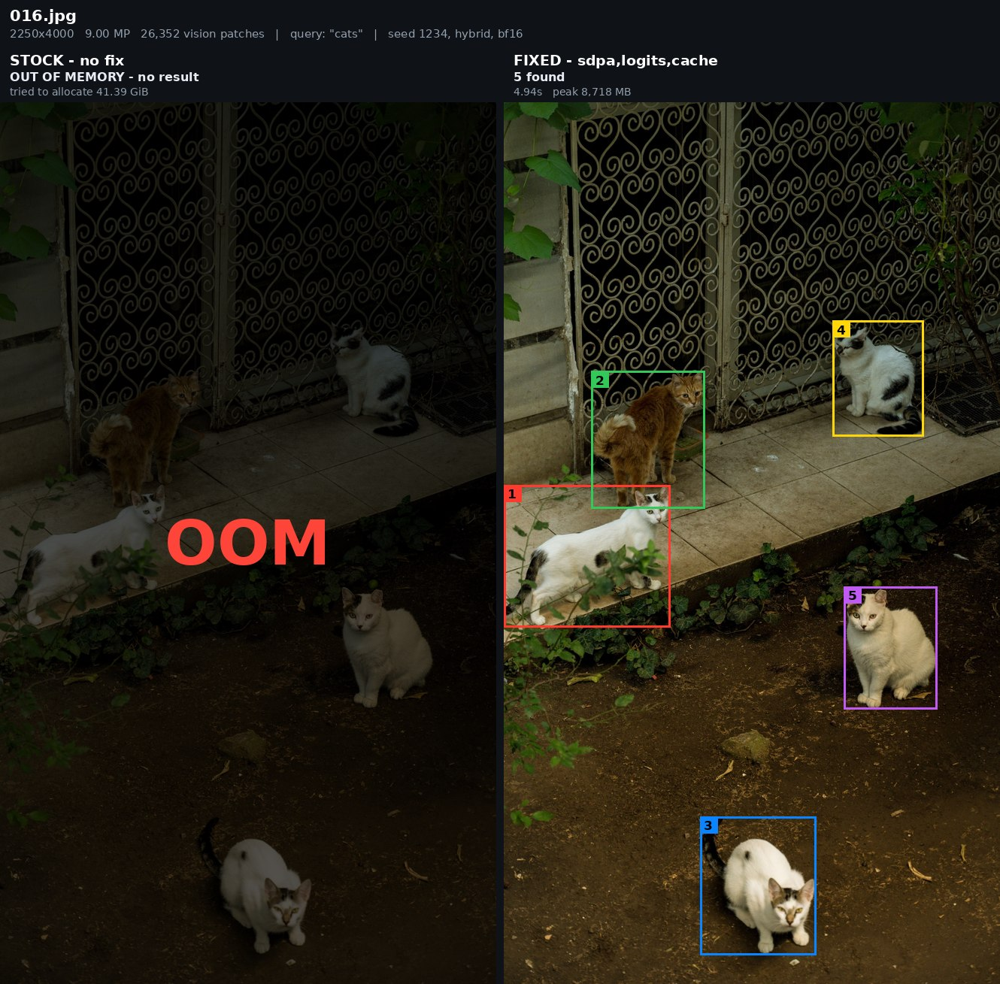
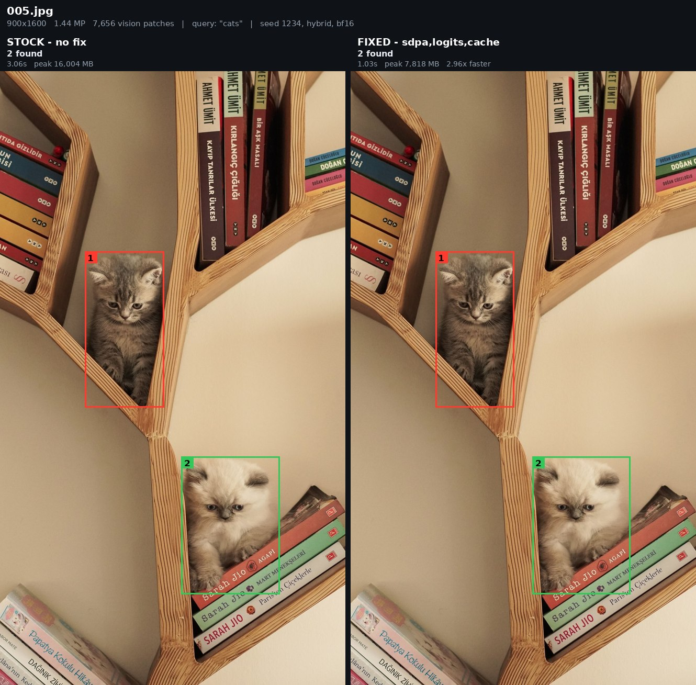
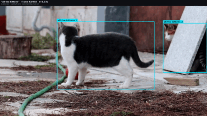

LocateAnything-3b Performance Tweaks
------------------------------------------

I was using nvidia LocateAnything, but I didn't feel it was performing the best, and I couldn't exactly afford an H100 all the time. With this fix you can
get it running larger batches and way bigger resolutions with a couple tweaks on a 3090 at least, so hopefully this helps someone out too. It should also work on a 5090, but I will post those results later. 



## the fixes

| | what | gain |
|---|---|---|
| **4-D sdpa** | vision encoder hands pytorch 3-D tensors, so every fused kernel is declined and the attention matrix is materialised in fp32 | everywhere |
| **logits slice** | wired up already, but only for the magi path — sdpa bypasses it and projects every prompt position through a 152,681-wide head | batch ≥ 4 |
| **vision cache** | re-encodes the image once per question | repeat queries |
| **packed vision** | several images share one ViT forward, off by default | +4-7% batched |
| **video decode** | not a speed fix — video is broken on torchvision ≥ 0.19 | video |


## the numbers

one image, 3090:

| image | patches | stock | fixed | real flash-attn |
|---|---|---|---|---|
| 1024px | 5,476 | 1.63s / 4499 MB | **0.62s / 1397 MB** | 0.62s / 1397 MB |
| 1400px | 10,000 | 4.62s / 14491 MB | **1.08s / 2456 MB** | 1.08s / 2456 MB |
| 1680px | 14,400 | **OOM** | **1.74s / 3486 MB** | 1.73s / 3486 MB |
| 2240px | 25,600 | **OOM** | **4.02s / 6134 MB** | 3.97s / 6134 MB |

byte-identical to real flash-attn, within 1% on time.

16 mixed-resolution photos, query "cats":

| | stock | fixed |
|---|---:|---:|
| completed | 8/16 | **16/16** |
| OOM | 8 | **0** |
| on the 8 both finished | 12.80s | **6.96s** |
| worst peak | 16,004 MB | **8,738 MB** |



h100, batched on 2K photos:

| batch | stock | + 4-D | + logits |
|---|---|---|---|
| 8 | **0.16 img/s** | 0.52 | **1.13** |
| 16 | **OOM** | **OOM** | 0.62 |
| 32 | **OOM** | **OOM** | 0.69 |

25,600 patches is `in_token_limit` from the model's own config. it OOMs on both
cards as shipped.

AP delta −0.0011 / −0.0021 against a shipped-vs-shipped control of 0.0000.

### these are all Detection prompts

Every number above is `Locate all the instances that matches ...`, which emits a
handful of boxes. The demo has four other task types and the model card
documents three more, and the speedup on them depends almost entirely on how
much the model has to say: 4.7x on GUI grounding, 3.6x on pointing, **1.4x on
OCR**, because a dense page spends its time in ~400 decode steps that none of
these fixes touch — and in the decode mode the demo actually uses for OCR, which
measurably reads better, it is ~1.02x. What the fixes buy on OCR is headroom,
not clock: stock OOMs on every cell above 10,000 patches, fixed completes all of
them.

Each of those is measured per task and split into vision / lm-prefill / decode.

### reproduced

Re-ran [`scripts/crossbox.py`](scripts/crossbox.py) on 2026-08-20 on a fresh
H100 PCIe, torch 2.11.0+cu128, no
flash-attn — a different machine from the August run:

| patches | stock (Aug) | stock (Aug 20) | fixed (Aug) | fixed (Aug 20) |
|---|---|---|---|---|
| 5,476 | 2.86s / **4491 MB** | 3.24s / **4491 MB** | 0.52s / **1389 MB** | 0.72s / **1389 MB** |
| 10,000 | 3.73s / **14483 MB** | 4.53s / **14483 MB** | 0.61s / **2448 MB** | 0.75s / **2448 MB** |
| 14,400 | 5.79s / **29707 MB** | 6.63s / **29707 MB** | 1.12s / **3478 MB** | 0.87s / **3478 MB** |
| 25,600 | **OOM** 39.06 GiB | **OOM** 39.06 GiB | 4.02s / **6127 MB** | 3.92s / **6127 MB** |

Also run on an **A100 80GB (sm_80)** the same day:

| patches | stock | fixed | speedup |
|---|---|---|---|
| 5,476 | 1.42s / **4491 MB** | 0.26s / **1388 MB** | 5.5x |
| 10,000 | 2.45s / **14483 MB** | 0.41s / **2449 MB** | 6.0x |
| 14,400 | 4.86s / **29707 MB** | 0.62s / **3478 MB** | 7.8x |
| 25,600 | **OOM** 39.06 GiB | 1.36s / **6127 MB** | — |


## video demo



1920x1080, detected at 10fps and held across a 30fps render. 134 frames in 23.5s.

## quickstart/install

```bash
git clone https://github.com/suzuenhasa/locateanything-perf.git
cd locateanything-perf
bash scripts/setup.sh            # checks the machine, installs, downloads, verifies
```

`setup.sh` checks the card, the driver's CUDA version, disk, and every pinned
dependency before it installs anything, then ends by running `verify_patch.py`
and refusing to claim success unless it prints `PATCH_VERIFIED`.

```bash
bash scripts/setup.sh --check    # verify an existing install, change nothing
bash scripts/setup.sh <sshhost>  # copy this repo to a remote box and install there
bash scripts/setup.sh --sglang   # ALSO patch an SGLang you already have — OCR only, see below
```

`--sglang` is **opt-in and off by default**, and it does not install SGLang. It
patches one that is already importable. Installing it into a working venv would
drag SGLang's own pinned torch over yours, which is how a good box stops being
one — so if SGLang is missing, setup stops and says so. Use an image that ships
it, or set `LA_SGLVENV=/path/to/venv` to have a sidecar built there. You only
need any of this if you are reading text in volume.

**do not install flash-attn** — transformers picks `flash_attention_2` for the
LM, qwen2 doesn't implement it, first forward dies.

### versions

```
MINIMUMS:  torch >= 2.0     transformers >= 4.51     python >= 3.9
MAXIMUMS:  none
```

**Both minimums come from upstream, not from this repo, and there is no upper
bound.** If your stack clears them, nothing here wants you to change it.

`setup.sh` installs as little as it can:

- torch already present → **used as-is, no wheels downloaded**, whatever version
- transformers at or above 4.51 → **left alone**, whatever version
- transformers below 4.51 → upgraded to the **minimum**, not the latest, and it
  tells you why first
- SGLang → **never installed**; it patches one you already have

Tested end to end, same page, **byte-identical output at every point** (28 boxes,
1,621 ref chars):

| torch | CUDA | transformers |
|---|---|---|
| 2.6.0+cu124 | 12.4 | 4.51.3 |
| 2.11.0+cu130 | 13.0 | 5.12.1 |
| 2.13.0+cu132 | 13.2 | 5.15.1 |

Where the two floors come from:

- **torch 2.0** is where `scaled_dot_product_attention` arrives — the one torch
  API the checkpoint cannot do without. It is also transformers' own declared
  floor. The checkpoint asserts no torch version at all.
- **transformers 4.51** is where `models.qwen3` appears, which
  `configuration_locateanything.py` and `modeling_locateanything.py` import at
  module level for a branch this checkpoint never takes — its own
  `architectures` is `Qwen2ForCausalLM`. Make that import lazy and the next wall
  is 4.45, at `processing_utils.Unpack`.

The ceiling used to be 4.57.1, because the checkpoint's code assumes
transformers 4.x in six places. `patches/05-transformers5-compat.patch` makes
all six version-agnostic — 4.x behaves exactly as before, and 5.x works. Five of
the six raise; the sixth does not, which is why it is applied unconditionally
rather than offered. The rotary embedding's buffers are `persistent=False`, so
they are absent from the checkpoint, and 5.x materialises them from meta
**without writing to them**:

```
inv_freq[:3] == [1.19e-26, 0.0, 0.0]     # should start at 1.0
```

`cos` is then non-finite and layer 0's attention is NaN on the first forward.
The model loads, every weight matches the safetensors byte for byte, and it
emits token soup.

## how to use

```python
import torch, locateanything_fix
from transformers import AutoModel, AutoTokenizer, AutoProcessor

MODEL = "nvidia/LocateAnything-3B"
tok = AutoTokenizer.from_pretrained(MODEL, trust_remote_code=True)
proc = AutoProcessor.from_pretrained(MODEL, trust_remote_code=True)
model = AutoModel.from_pretrained(MODEL, dtype=torch.bfloat16,
                                  trust_remote_code=True).to("cuda").eval()

locateanything_fix.apply()        # must be after from_pretrained
```

opt-in, by workload:

```python
locateanything_fix.enable_vision_cache(model, maxsize=4)  # many queries, one image
locateanything_fix.enable_logits_slice(model)             # batch >= 4
locateanything_fix.enable_packed_vision()                 # needs apply() first
locateanything_fix.enable_video_decode()                  # video
```

| | 4-D | logits | cache | packed |
|---|---|---|---|---|
| one image, one query | **yes** | — | — | — |
| one image, many queries | **yes** | — | **yes** | — |
| many images, batched | **yes** | **yes** | — | **yes** |

keep the model resident — load is 4.04s and the first inference is 2x steady
(1.19s vs 0.59s).

## running it

```bash
python scripts/verify_patch.py --model /path/to/LocateAnything-3B   # confirm the fix is live
python scripts/serve.py       --model /path/to/LocateAnything-3B --bench ./images
python scripts/tile_ocr.py    --model /path/to/LocateAnything-3B --image ./page.jpg
```

`serve.py` keeps the model resident and torch.compiled across requests; `tile_ocr.py`
splits a page into a grid, runs the tiles as one batch, and dedupes the boxes.
Flags in [scripts/README.md](scripts/README.md).

## measured, on this repo, on one 3090

Clean install from this checkout, RTX 3090 24 GB, bf16, no flash-attn. Corpus:
16 photographs and 9 page scans — book pages, a magazine spread, an invoice.

The locate and memory tables below were measured on torch 2.11.0+cu128 /
transformers 4.57.1; the text tables were re-measured on torch 2.11.0+cu130 /
transformers 5.12.1 with patches/04 applied. Box counts are unchanged across
every stack in the version table above.

### locate — 16 photographs, one prompt, five resolutions

| patches | pixels (typical) | mean/photo | instances found |
|---|---|---:|---:|
| 2,500 | 606x808 | 0.39s | 54 |
| 5,476 | 897x1196 | 0.64s | 55 |
| 10,000 | 1212x1616 | 1.04s | 55 |
| 14,400 | 1455x1940 | 1.57s | 55 |
| 25,600 | 1940x2586 | 3.55s | 55 |

**Resolution does not buy recall on this task.** The same 55 instances across 16
photographs at every rung, 9x the time. One photo gains one instance between the
first two rungs and nothing changes after that. The reason to have the headroom
is that the shipped code cannot run the middle of that table at all — see below.

### the fix, three ways

Same photo, same prompt. `sdpa-only` is `apply()` alone; `fixed` adds
`enable_logits_slice(keep=6)`.

| patches | stock | sdpa-only | fixed |
|---|---|---|---|
| 5,632 | 1.65s / 4,808 MB | 0.79s / 1,494 MB | 0.75s / 372 MB |
| 10,320 | 4.21s / 15,526 MB | 1.80s / 2,635 MB | 1.45s / 596 MB |
| 14,484 | **OOM** | 2.11s / 3,635 MB | 1.91s / 862 MB |
| 25,840 | **OOM** | 4.79s / 6,421 MB | 3.83s / 1,394 MB |
| 40,460 | **OOM** | 7.89s / 10,001 MB | 8.15s / 1,816 MB |
| 66,272 | **OOM** | 18.38s / 15,773 MB | 18.54s / 3,298 MB |

Across all eight prompt templates at 10,000 patches the SDPA change alone is
**1.9-3.8x faster (mean 3.2x) and 5.4-6.0x less activation memory**; with
`logits_slice` the memory figure becomes 18.5-28.7x. The two remove different
costs — the attention change is quadratic in patches, `logits_slice` is linear
in tokens times the 152,681-token vocabulary — so below ~10k patches the first
dominates and above it the second does. Neither alone gets you high resolution.

Stock's failure is exact. Every OOM matches a dense tensor over
`S = (2*ceil(w/28)) * (2*ceil(h/28))`, the processor's real patch grid: the bool
mask at 1 byte, torch's bf16 copy of it at 2, and the fp32 attention score
matrix `[16,S,S]` at 64. Whichever first exceeds free VRAM is what you see —
fitted against all nine OOM rows, worst error 0.05%, no free parameters.

### reading text

Nine pages, `tile_ocr.py`, 10,000 patches, **with patches/04 applied** so the
text is actually correct:

| | per page | 9 pages | regions |
|---|---:|---:|---:|
| whole page | 17.86s | 160.7s | 347 |
| **tiled 3x3, batched** | **10.14s** | **91.3s** | 869 |

Tiling and batching is **1.76x faster than a single whole-page pass and finds
about 2.5x as many regions**, with ~23% more transcribed text.

Read the absolute numbers with the next section in mind. Before patches/04 the
same corpus ran at 7.98s and 5.06s a page — but that was the model speculating
six tokens of prose per forward and never checking them, so the boxes were right
and the words were mush. Correct text costs roughly 2x. The 1.76x that tiling
buys is unaffected either way.

Serving the same nine pages with the model resident (`serve.py`, 2x3 tiles,
`--temperature 0`, patches/04 applied):

| | per page | ms/forward | startup |
|---|---:|---:|---:|
| eager | 8.92s | 53.75 | 7.2s |
| `--compile` | 6.70s | 40.34 | 387.7s |

**`ms/forward` is the invariant unit here, and patches/04 does not move it** —
53.75 against 53.15 measured before the patch, a 1.1% difference. Correct text
is not a slower engine, it is more forwards: the model stops speculating six
tokens of prose per pass and emits them one at a time.

`--compile` is **1.33x per forward**, exactly as before. What it costs depends
on whether torch's inductor cache is warm, and that is the difference between
compile being worth it and not:

| | startup | saves 2.22s/page, so pays back at |
|---|---:|---:|
| first compile on a box (cold cache) | 387.7s | ~171 pages |
| **every later process start (warm)** | **181.5s** | **~78 pages** |
| `--no-compile` | 7.2s | n/a |

**You pay 181.5s on every process start, not once.** `torch.compile` traces in
memory; what survives is the on-disk inductor cache (94 MB at
`/tmp/torchinductor_$USER`), which halves the trace but does not remove it.

Two consequences worth knowing:

- The cache lives under `/tmp`, which is not persistent everywhere — containers
  and scratch filesystems lose it. If that is your situation, point
  `TORCHINDUCTOR_CACHE_DIR` somewhere that survives, or every start pays the
  388s cold price again.
- If your process handles fewer than ~78 pages before exiting, `--no-compile`
  wins outright. Compile is for a long-lived `serve.py`, not for a run that
  starts and stops.

An earlier version of this file quoted 177s. That was a *warm-cache* number
compared against a cold one — not a hardware or version difference, which is
what it was originally attributed to. Holding box and torch fixed and changing
only transformers, cold in both cases, 5.x does trace more: 320.0s / 26 graphs
on 4.51.3 against 387.7s / 42 graphs on 5.12.1. Real, but not the thing that
matters here.

### OCR text quality needs SGLang

The box counts above are right in every mode. **The transcribed text is not.**

This model decodes six tokens per forward through its parallel box decoder. For
coordinates (`<x0><y0><x1><y1>`) the next six tokens are nearly determined and
that works. For prose they are not, the speculation is not rejected, and the
output stutters. Measured on a scanned book page, same page, same prompt:

| decode path | seconds | transcription |
|---|---:|---|
| `generation_mode="slow"` (pure AR) | 19.24 | `...that have taken their procession flight` |
| `generation_mode="hybrid"` | 5.14 | `...that the taken theirionalional located flight` |
| `generation_mode="fast"` | 5.10 | byte-identical to `hybrid` |
| **SGLang** | **5.32** | `...that have taken their procession flight` |

`hybrid` is documented to fall back to AR on error; on this page it never did,
producing output byte-identical to `fast`. `slow` is correct and 3.7x slower.

SGLang has no parallel box decoder at all — decode is one token per forward — so
it cannot stutter, and it gets its speed from batching across requests instead.
It transcribed the page identically to `slow` (28 regions, 1,618 chars against
1,619) in 5.32s. How far that scales across concurrent pages is measured below.

`patches/04-hybrid-ar-fallback-on-text.patch` fixes the fallback in the model
itself, and `setup.sh --fix-decode` applies it. That buys correct text without
SGLang, at 19.4s a page against SGLang's 5.3s — the gap is not algorithmic, it
is that the model's decode loop runs at 21% of this card's memory-bandwidth
roofline (31.5 ms/token) where SGLang runs at 73% (9.0 ms/token). Closing that
means CUDA graphs and continuous batching, which is what SGLang already is.

**So, three ways to be correct, pick by what you are doing:**

| | text | boxes | needs |
|---|---|---|---|
| locating only | n/a | correct | nothing beyond `apply()` |
| some OCR | correct, 19.4s/page | correct | `setup.sh --fix-decode` |
| OCR in volume | correct, 1.35s/page at 9 concurrent | correct | an SGLang install, then `setup.sh --sglang` |

Detection, grounding, pointing and GUI grounding are identical across every
decode path and need none of this.

### if you use SGLang, two patches — and one of them depends on the version

**`patches/06-sglang-moonvit-sdpa-4d.patch` is required.**
`sglang/srt/models/kimi_vl_moonvit.py` is a verbatim vendoring of the
checkpoint's `modeling_vit.py`, so it carries the same 3-D SDPA defect
patches/01 fixes — and `locateanything_fix.apply()` cannot reach it, because the
server is a different process running a different module. Unpatched, the server
loads clean, reports healthy, and dies on the first full-resolution page:

```
kimi_vl_moonvit.py:172  F.scaled_dot_product_attention(q, k, v, attention_mask, ...)
torch.OutOfMemoryError: Tried to allocate 10.62 GiB
[SIGQUIT received. It usually means one child failed.]
```

taking the whole server down, not just the request. It bites harder here than
in-process because `--mem-fraction-static` has already claimed 80% of the card
before the vision tower asks for scratch. Launch with `LA_VIT_FASTMASK=1` or the
patch is inert.

**`patches/02-sglang-locateanything-vision-weights.patch` depends on your SGLang
version, and getting it wrong fails silently in both directions.** It renames the
checkpoint's vision tensors (`wqkv`/`wo`) to the names older SGLang used
(`attn.qkv_proj`/`attn.proj`). Newer SGLang renamed its *own* modules to match
the checkpoint instead — upstream fixed this — so on those builds the patch
renames the tensors **away** from the correct names. It still applies cleanly,
which is the trap.

Either way the result is the same and it does not look like a failure: all 54
vision-attention tensors miss `params_dict` and stay at random init, the tower
still loads its MLPs and norms, **the server comes up healthy**, and every box is
the whole image `<0><0><1000><1000>` because the model never sees the picture.
Measured on sglang 0.5.16: patched, 108 parameters did not receive weights;
reverted, 0.

`setup.sh --sglang` detects which way your SGLang goes rather than assuming,
applies or reverts accordingly, and `--check` fails if patches/02 is applied to a
build that does not want it.

### how much slower is OCR without SGLang

Nine **distinct** page scans, whole-page OCR, one RTX 3090. Same nine files
through both paths, warm server:

| | 9 pages | per page |
|---|---:|---:|
| in-process, patches/04 applied | 160.7s | 17.9s |
| SGLang, one page at a time | 54.7s | 6.08s |
| SGLang, 3 concurrent | 22.5s | 2.50s |
| SGLang, 6 concurrent | 12.9s | 1.44s |
| **SGLang, 9 concurrent** | **12.1s** | **1.35s** |

Concurrency saturates around six — past that the card is the limit, not the
scheduler. End to end that is **13x** on the same nine pages.

Two separate gaps, and they compound:

- **per request, 2.9x.** The model's decode loop runs at 21% of this card's
  memory-bandwidth roofline (31.5 ms/token); SGLang runs at 73% (9.0 ms/token).
- **across requests, another 4.5x.** The in-process engine serves pages one
  after another. It batches tiles *within* a page — that is what the 1.76x above
  is — but it cannot overlap *pages*. SGLang does. That is the part you do not
  have without it.

Boxes are identical either way, and detection, grounding, pointing and GUI
grounding are unaffected. This only matters if you are reading text in volume.
`setup.sh` says which path you are on whether or not you pass `--sglang`.

Measured on sglang 0.5.16, torch 2.11.0+cu130, transformers 5.12.1, one venv —
the second venv is no longer needed now that the checkpoint runs on
transformers 5.x.

> An earlier version of this table reported 1,137 tok/s at 18 concurrent. That
> benchmark sent the *same* image 18 times, so SGLang's radix cache could serve
> the shared prefill and the number was inflated. Everything above uses nine
> different pages.
